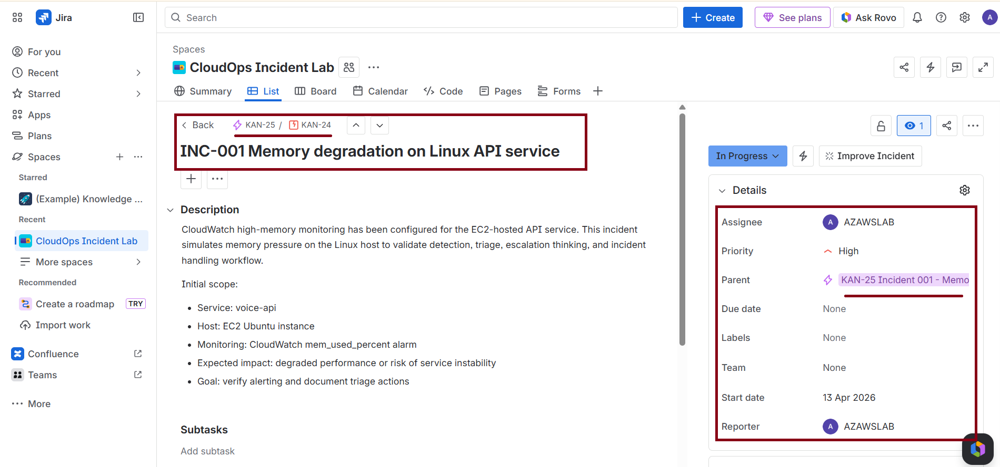
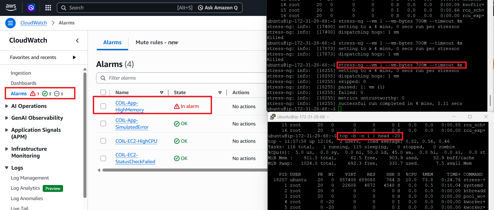
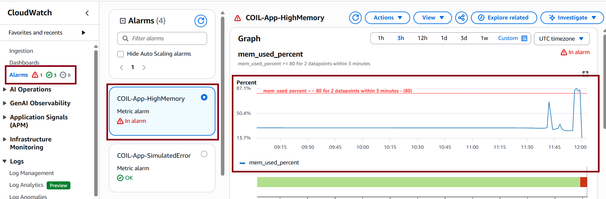
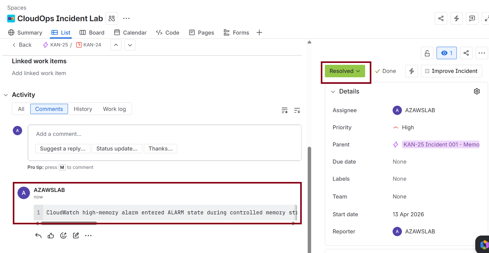

# INC-001 Memory degradation on Linux API service

## Summary

Controlled memory pressure was generated on the EC2-hosted API service to validate CloudWatch high-memory alerting, Linux triage workflow, and incident handling discipline.

## Detection

- **Monitoring source:** CloudWatch
- **Alarm:** `COIL-App-HighMemory`
- **Metric:** `mem_used_percent`
- **Threshold:** `>= 80 for 2 datapoints within 3 minutes`

## Impact

- The service remained reachable throughout the test
- Elevated memory usage created a realistic risk of degraded performance and service instability
- The incident was used to validate monitoring, first-line triage, and operational response

## Environment

- **Host:** EC2 Ubuntu instance
- **Service:** `voice-api`
- **Service manager:** `systemd`
- **Validation endpoint:** `/health`

## Timeline

- Controlled memory stress started using `stress-ng`
- CloudWatch `COIL-App-HighMemory` entered `ALARM`
- Linux triage commands were executed to assess host and service condition
- The `/health` endpoint remained available during investigation
- Memory pressure ended and the alarm returned to `OK`
- The incident was documented and resolved in Jira

## Commands used

- `stress-ng --vm 1 --vm-bytes 700M --timeout 4m`
- `free -m`
- `top -b -n 1 | head -20`
- `ps aux --sort=-%mem | head -10`
- `sudo systemctl status voice-api --no-pager`
- `sudo journalctl -u voice-api -n 50 --no-pager`

## Evidence

## Outcome

The incident successfully validated memory-based detection, alarm state transition, Linux triage workflow, and service continuity checks. Memory pressure was visible at the host level, the API remained available, and the alarm returned to `OK` once the controlled stress ended.

## Linked records

- **Problem record:** `PRB-001-recurring-memory-growth`
- **Jira issue:** `INC-001 Memory degradation on Linux API service`