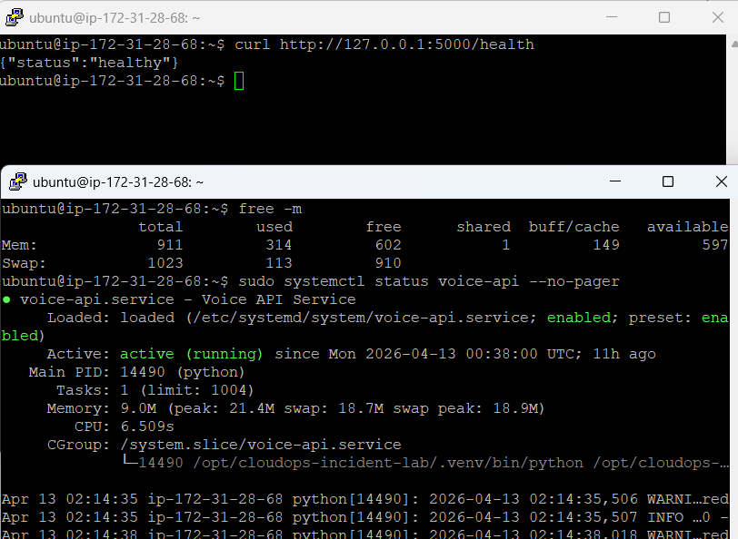

# Triage Notes - INC-001

## Initial signal

CloudWatch high-memory monitoring triggered for the EC2-hosted API service through the `COIL-App-HighMemory` alarm.

## Immediate checks

The following first-line checks were used during triage:

- `free -m`
- `top -b -n 1 | head -20`
- `ps aux --sort=-%mem | head -10`
- `sudo systemctl status voice-api --no-pager`
- `sudo journalctl -u voice-api -n 50 --no-pager`
- `curl http://127.0.0.1:5000/health`

## Key observations

- `stress-ng` was the highest memory-consuming process during the controlled test
- the `voice-api` service remained active under `systemd`
- the `/health` endpoint continued to return a healthy response
- no application crash occurred
- no unexpected service restart was observed during the incident window

## Technical interpretation

This was a **host resource pressure event** rather than an application crash.

The incident showed that:

- memory pressure was visible at the host level
- the application remained available during the event
- service health and host pressure must be assessed separately
- sustained memory growth could still become service-impacting if left unresolved

This is operationally important because an instance can remain technically up while moving into a degraded risk state.

## Triage conclusion

The alarm was valid, the host showed elevated memory pressure, and the service remained reachable throughout the test. The event confirmed that CloudWatch detection, Linux validation, and service-level checks worked as expected for a memory-related incident scenario.