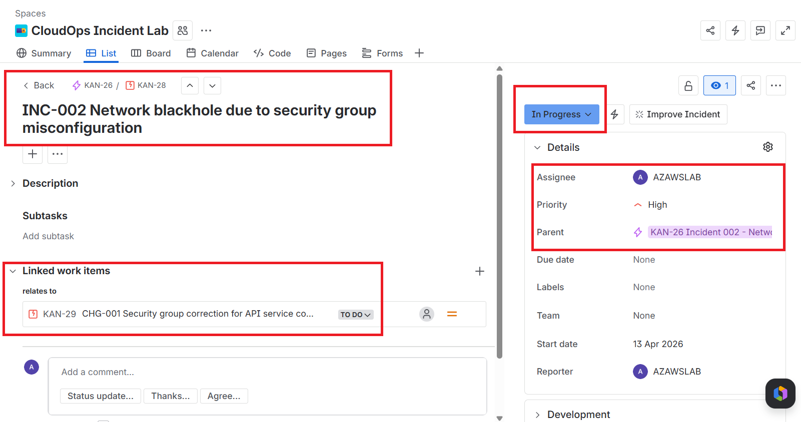

# INC-002 Network blackhole due to security group misconfiguration

## Summary

External reachability to the EC2-hosted API service was intentionally broken by removing the inbound security group rule for TCP port `5000`.

The objective was to validate network-focused triage, confirm the difference between local service health and external access failure, and restore service through a controlled change action.

## Detection

- **Detection method:** browser/public endpoint validation
- **Affected endpoint:** `/health`
- **Expected external path:** `http://PUBLIC_IP:5000/health`
- **Initial symptom:** external browser request timed out after the inbound port `5000` rule was removed

## Impact

- External/public access to the API failed
- The service itself remained healthy on the EC2 host
- This demonstrated a network-path issue rather than an application or host failure

## Environment

- **Host:** EC2 Ubuntu instance
- **Service:** `voice-api`
- **Port:** `5000`
- **Service manager:** `systemd`
- **Security control involved:** EC2 security group inbound rules

## Timeline

- Baseline validation confirmed `/health` worked externally and locally
- Incident 002 Jira ticket was created and moved to `In Progress`
- Inbound port `5000` rule was removed from the security group
- External browser access failed
- Local EC2 validation confirmed `/health` still worked on `127.0.0.1`
- `systemctl status voice-api` confirmed the service was active
- `ss -tulpn | grep 5000` confirmed the process was still listening
- Change action `CHG-001` restored the port `5000` rule
- External access was restored
- Incident and change records were resolved

## Commands used

- `curl http://127.0.0.1:5000/health`
- `sudo systemctl status voice-api --no-pager`
- `ss -tulpn | grep 5000`
- `sudo journalctl -u voice-api -n 30 --no-pager`

## Evidence

## Technical interpretation

This incident was a **network blackhole scenario caused by security-group configuration**, not an application outage.

The key distinction was:

- local service health remained good
- external access failed
- the listening socket remained present
- restoring the inbound rule restored service

This is operationally important because it shows how a service can appear down to users while the application itself is still healthy on the host.

## Outcome

The incident successfully validated:

- AWS security group troubleshooting
- fault-domain isolation between network and application
- controlled rollback through change handling
- evidence-based incident resolution

## Related records

- [Triage notes](./triage-notes.md)
- [Handover note](./handover-note.md)
- [Stakeholder update](./stakeholder-update.md)
- [Change record — CHG-001 Security group correction](../../change-records/CHG-001-security-group-correction.md)
- [Monitoring README](../../../monitoring/README.md)
- [CloudWatch alarms](../../../monitoring/cloudwatch-alarms.md)
- [Alert scenarios](../../../monitoring/alert-scenarios.md)
- [Incidents index](../README.md)
