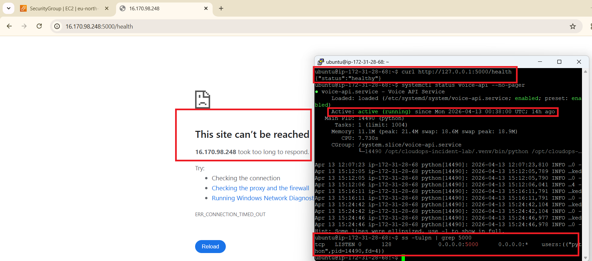

# Triage Notes - INC-002

## Initial signal

External access to the API `/health` endpoint failed after the inbound rule for port `5000` was removed from the EC2 security group.

## Immediate checks

The following first-line checks were used during triage:

- verified browser/public access failure to `http://PUBLIC_IP:5000/health`
- checked local API health from the EC2 host with `curl http://127.0.0.1:5000/health`
- confirmed service state with `sudo systemctl status voice-api --no-pager`
- confirmed the listening socket with `ss -tulpn | grep 5000`
- reviewed EC2 security group inbound rules in the AWS Console

## Key observations

- browser/public access timed out
- local `curl` returned `{"status":"healthy"}`
- `voice-api` remained active under `systemd`
- port `5000` was still listening locally
- the security group no longer allowed inbound access on port `5000`

## Fault-domain assessment

This was **not** an application failure and **not** an EC2 host failure.

The fault domain was the **network access path** controlled by the EC2 security group.

This distinction was confirmed by three facts:

- the service responded locally
- the process was still listening on port `5000`
- external access failed only after the inbound rule was removed

## Why this mattered

Without local validation, this incident could easily have been misclassified as an application outage.

The triage process showed the importance of separating:

- external reachability
- local process health
- host health
- security control configuration

This is an important platform-operations skill because different fault domains require different recovery actions.

## Resolution path

The issue was resolved by restoring the inbound security group rule for TCP port `5000` through the linked change record.

## Triage conclusion

The incident confirmed that the application and host remained healthy while the network path was broken by security-group configuration. The correct recovery path was therefore a controlled network-rule restoration, not an application restart or host-level remediation.

## Related records

- [Incident record](./incident-record.md)
- [Handover note](./handover-note.md)
- [Stakeholder update](./stakeholder-update.md)
- [Change record — CHG-001 Security group correction](../../change-records/CHG-001-security-group-correction.md)
- [Monitoring README](../../../monitoring/README.md)
- [CloudWatch alarms](../../../monitoring/cloudwatch-alarms.md)
- [Alert scenarios](../../../monitoring/alert-scenarios.md)
- [Incidents index](../README.md)
- [Linux operations](../../../linux-ops/README.md)
- [Linux troubleshooting cheat sheet](../../../linux-ops/linux-troubleshooting-cheat-sheet.md)
