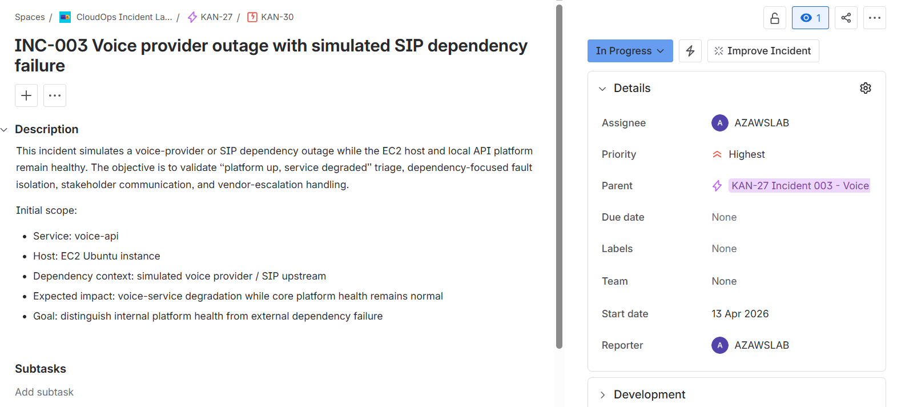
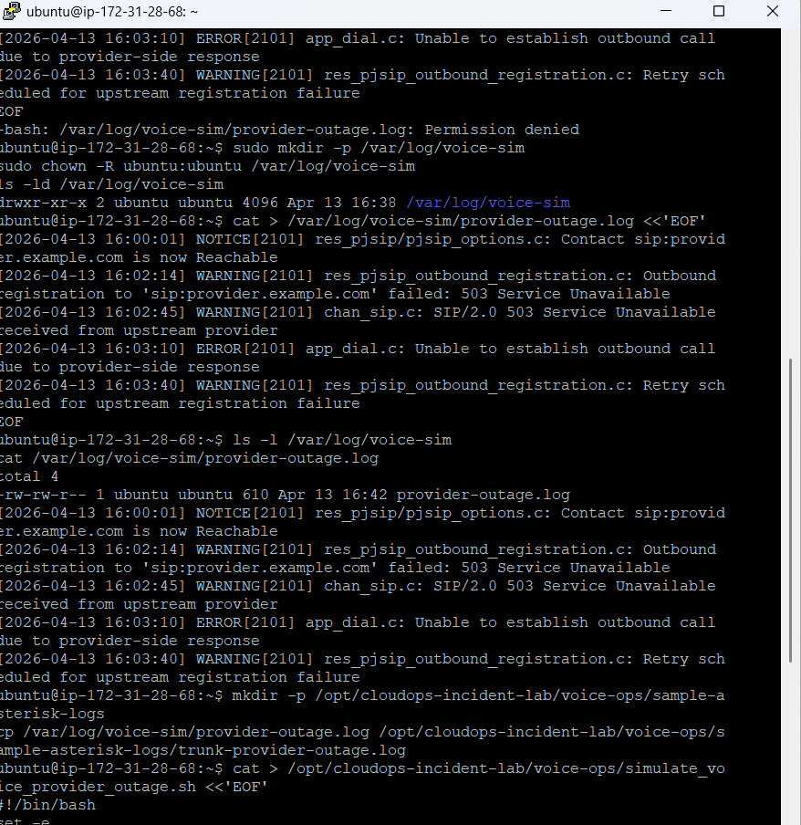
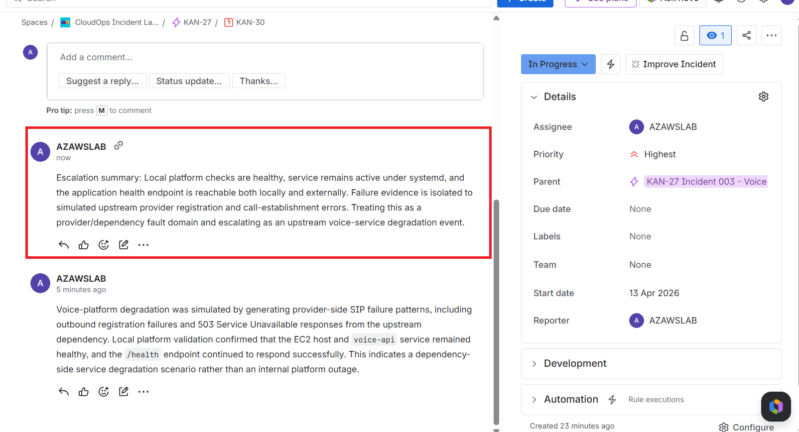
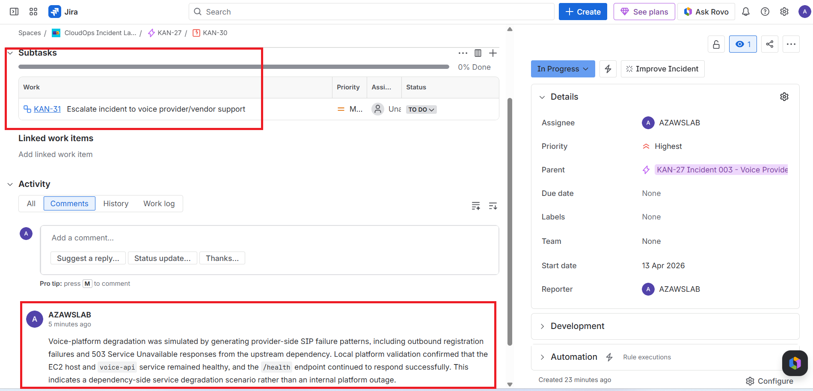

# INC-003 Voice provider outage with simulated SIP dependency failure

## Summary

A voice-provider or SIP dependency outage was simulated while the EC2 host, `voice-api` service, and `/health` endpoint remained healthy.

The objective was to validate **“platform up, service degraded”** triage and dependency-focused fault isolation.

## Detection

- **Detection source:** simulated provider-side voice logs
- **Failure pattern:**
  - outbound registration failure
  - `503 Service Unavailable`
  - outbound call establishment failure
- **Validation method:**
  - voice dependency log review
  - local API health check
  - `systemd` service validation

## Impact

- Simulated voice-service degradation occurred
- Core platform remained available
- Host and API health stayed normal
- This demonstrated dependency failure rather than internal platform outage

## Environment

- **Host:** EC2 Ubuntu instance
- **Service:** `voice-api`
- **Service manager:** `systemd`
- **Dependency context:** simulated upstream voice provider / SIP registration path

## Timeline

- Incident 003 Jira record created
- Simulated provider-outage log created
- Additional provider-failure events generated
- Voice log review confirmed repeated upstream registration and `503` failures
- Local platform validation confirmed `/health` remained healthy
- `voice-api` remained active under `systemd`
- Dependency/vendor-style escalation note was added in Jira
- Incident resolved after completion of the validation exercise

## Commands used

- `tail -n 20 /var/log/voice-sim/provider-outage.log`
- `grep -i "503\|registration\|Unable to establish outbound call" /var/log/voice-sim/provider-outage.log`
- `curl http://127.0.0.1:5000/health`
- `sudo systemctl status voice-api --no-pager`

## Evidence

## Technical interpretation

This incident demonstrated a **dependency-side service degradation** pattern.

The EC2 host and API platform remained healthy, so restarting the application or treating the event as a full platform outage would have been the wrong response.

The key distinction was:

- the platform remained up
- the application remained healthy
- the degraded condition was caused by an upstream dependency
- the correct response path was dependency-focused investigation and escalation, not host or application recovery action

## Outcome

The incident successfully validated:

- voice-platform dependency failure handling
- **“platform up, service degraded”** reasoning
- vendor/dependency escalation judgement
- separation of internal platform health from upstream service failure

## Related records

- [Triage notes](./triage-notes.md)
- [Handover note](./handover-note.md)
- [Stakeholder update](./stakeholder-update.md)
- [Vendor escalation note](./vendor-escalation-note.md)
- [Incidents index](../README.md)
