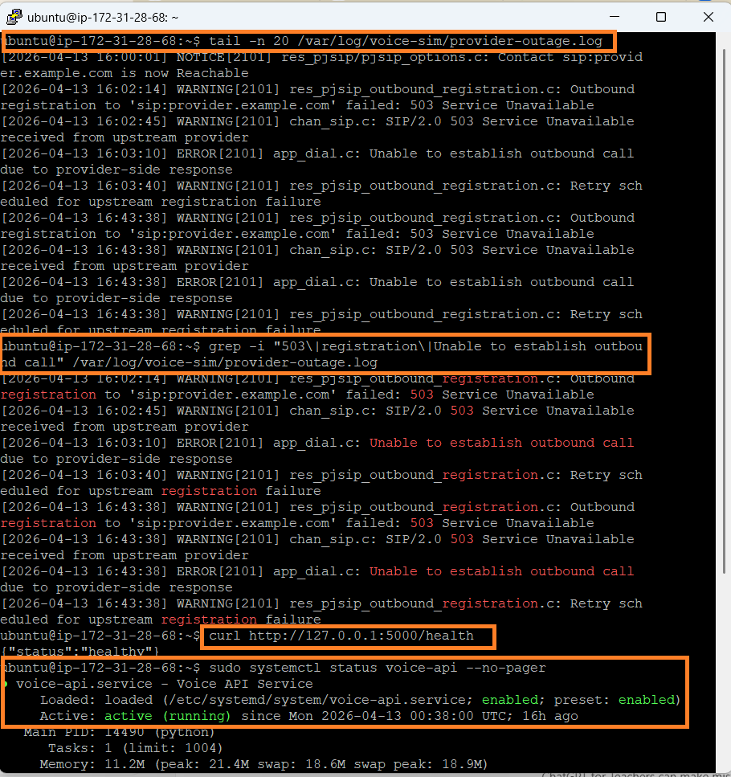

# Triage Notes - INC-003

## Initial signal

Voice-service degradation was simulated through provider-style SIP failure patterns, including registration failures and `503 Service Unavailable` responses.

## Immediate checks

The following first-line checks were used during triage:

- reviewed voice dependency log output
- checked for `503`, registration failure, and call-establishment failure patterns
- validated local platform health with `curl http://127.0.0.1:5000/health`
- confirmed `voice-api` remained active using `sudo systemctl status voice-api --no-pager`

## Key observations

- repeated provider-style registration failures were present
- upstream `503 Service Unavailable` messages were visible
- outbound call-establishment failure was visible in the simulated logs
- the EC2 host remained healthy
- the `voice-api` service remained active
- the `/health` endpoint continued to return healthy responses

## Fault-domain assessment

This was **not** a host failure, **not** an operating-system failure, and **not** a local application outage.

The correct fault domain was the **upstream voice-provider / SIP dependency path**.

This was confirmed by two parallel facts:

- dependency-side failure evidence was present in the simulated provider logs
- the local platform remained healthy and responsive

## Why this mattered

This incident demonstrates why operations teams must avoid treating every degraded service event as a server failure.

In this case:

- local platform health checks remained normal
- restarting the service would not have addressed the dependency issue
- the correct response path was dependency-focused assessment and escalation

This is an important operations judgment call because the wrong fault-domain assumption leads to the wrong remediation.

## Resolution path

The event was handled as a dependency-side degradation scenario. Platform validation remained normal, evidence was captured, and a vendor/dependency-style escalation path was documented in Jira.

## Triage conclusion

The incident confirmed that the platform remained healthy while the service degraded because of an upstream dependency pattern. This validated the need to separate **platform health** from **dependency health** and to escalate accordingly rather than performing unnecessary local recovery actions.

## Related records

- [Incident record](./incident-record.md)
- [Handover note](./handover-note.md)
- [Stakeholder update](./stakeholder-update.md)
- [Vendor escalation note](./vendor-escalation-note.md)
- [Incidents index](../README.md)
- [Linux operations](../../../linux-ops/README.md)
- [Linux troubleshooting cheat sheet](../../../linux-ops/linux-troubleshooting-cheat-sheet.md)
