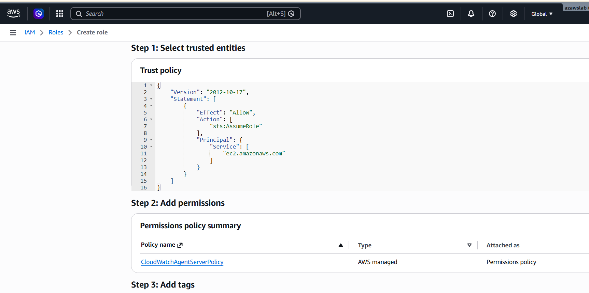
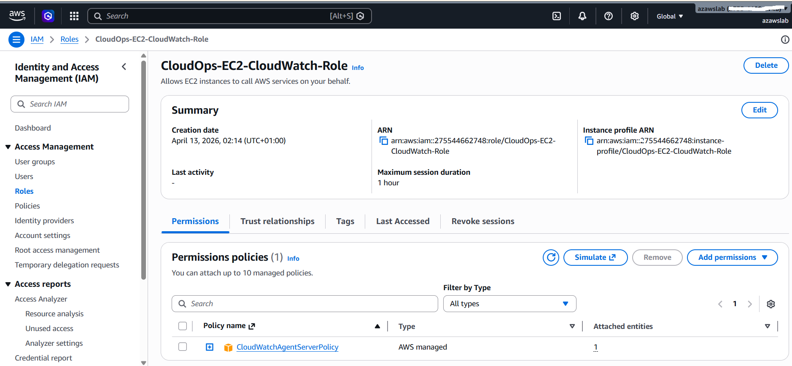

# Monitoring

This folder documents the monitoring setup used in the **CloudOps Incident Lab**.

The monitoring design is intentionally practical rather than over-engineered. Its purpose is to show how a small AWS-hosted service can be monitored in a realistic platform-operations workflow using **CloudWatch**, **CloudWatch Agent**, log-based metrics, and alarm-driven triage.

## Monitoring objective

The monitoring layer in this project is designed to support:

- early detection of host or application issues
- first-line operational triage
- incident documentation and evidence capture
- realistic alert interpretation for a platform operations role

The goal is not to build an enterprise-scale observability platform. The goal is to demonstrate clear operational judgment using standard AWS tooling.

## Monitoring architecture

The monitoring flow in this lab is:

1. A real Ubuntu EC2 instance hosts the API service
2. An IAM role is attached so the instance can publish logs and metrics to CloudWatch
3. The Amazon CloudWatch Agent is installed and running on the instance
4. Standard EC2 metrics and custom instance metrics are collected
5. Application log events are sent to CloudWatch Logs
6. A metric filter is used to detect simulated application errors
7. Four CloudWatch alarms are configured to represent meaningful operational conditions

## EC2 and CloudWatch integration

The project uses a real EC2 instance connected to CloudWatch through an IAM role and the CloudWatch Agent.

### IAM role creation

An IAM role was created for EC2 with the `CloudWatchAgentServerPolicy` policy attached.






This allows the instance to publish logs and metrics to CloudWatch without embedding credentials on the host.

### Attaching the IAM role to the EC2 instance

The role was then attached to the running EC2 instance.


This step is what makes the instance eligible to send CloudWatch Agent data and application log data to AWS.

### CloudWatch Agent on EC2

The Amazon CloudWatch Agent was installed and confirmed running on the EC2 instance.


This supports collection of custom host-level metrics such as memory usage that are not available from standard EC2 metrics alone.

## Custom metrics and logs

The lab collects and uses CloudWatch data from multiple sources:

- **Standard EC2 metrics**
  - instance status
  - CPU utilisation

- **Custom host metrics via CloudWatch Agent**
  - memory usage percentage
  - disk usage percentage

- **Application logs via CloudWatch Logs**
  - API access and application behaviour
  - simulated error events

### CloudWatch log ingestion

Application logs are visible in CloudWatch Logs and provide evidence for service activity and error events.


### Custom memory metric

The CloudWatch Agent publishes memory usage as a custom metric.


### Custom disk metric

The CloudWatch Agent also exposes disk usage as a custom metric.


Disk monitoring is included as supporting host visibility, even though it is not one of the four main incident alarms in the public portfolio version.

## Log-based metric filter for simulated application errors

To represent application-level failure in a simple but realistic way, the lab uses a CloudWatch Logs metric filter.

The filter pattern is:

```text
Simulated application error triggered