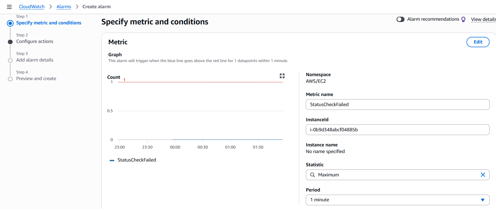

# CloudWatch Alarms

This file documents the four core CloudWatch alarms used in the **CloudOps Incident Lab**.

These alarms provide first-line operational visibility across:

- EC2 infrastructure health
- host resource pressure
- application-level failure signals

For the wider monitoring setup, including IAM role attachment, CloudWatch Agent setup, custom metrics, and log ingestion, see [`README.md`](./README.md).

## Configured alarms

The public portfolio version uses these four alarms:

1. `COIL-EC2-StatusCheckFailed`
2. `COIL-EC2-HighCPU`
3. `COIL-App-HighMemory`
4. `COIL-App-SimulatedError`

This alarm set is intentionally small but operationally useful. It covers core infrastructure, performance, memory pressure, and application error behaviour.

## Alarm details

### 1. `COIL-EC2-StatusCheckFailed`

**Source metric:** `AWS/EC2 -> StatusCheckFailed`  
**Threshold:** trigger when the metric is `>= 1` within `1 minute`  
**Purpose:** detect EC2 instance health problems at the infrastructure level

Operational meaning:

- the host may be impaired or unavailable
- first checks should focus on EC2 health, instance reachability, and AWS-level platform signals
- this is not primarily an application alarm; it is a host/platform alarm

## 2. `COIL-EC2-HighCPU`

**Source metric:** `AWS/EC2 -> CPUUtilization`  
**Threshold:** trigger when average CPU utilisation is `>= 70%`  
**Purpose:** detect sustained CPU pressure on the EC2 instance

Operational meaning:

- the host may be under load
- application response times may degrade
- a process may be consuming abnormal CPU
- this supports first-line Linux and service triage

## 3. `COIL-App-HighMemory`

**Source metric:** `CloudOpsIncidentLab -> mem_used_percent`  
**Threshold:** trigger when average memory usage is `>= 80%`  
**Purpose:** detect host memory pressure that may affect the API service

Operational meaning:

- the application host may be under memory pressure
- service performance may degrade
- Linux memory checks and process-level investigation should begin
- this alarm is directly relevant to **INC-001**

## 4. `COIL-App-SimulatedError`

**Source metric:** log-derived application error metric  
**Threshold:** trigger when the simulated error metric is detected within the configured evaluation window  
**Purpose:** detect controlled application failure signals from logs

Operational meaning:

- the application emitted a known error pattern
- this validates the log-based alerting path
- this supports application-level incident detection even when EC2 host health is still normal

## Important note on the simulated error alarm

The simulated application error alarm depends on a **CloudWatch Logs metric filter**.

That means the setup includes one extra supporting step before the alarm itself exists:

1. create a metric filter on the application log group
2. create an alarm from the resulting metric

The metric filter is shown here:

This is why the screenshot set contains both:

- a **metric filter configuration** screenshot
- the **final alarm configuration** screenshot

The metric filter is not a fifth alarm. It is a prerequisite for the fourth alarm.

## Incident mapping

The alarms map to the operational scenarios in the project as follows:

- `COIL-App-HighMemory` -> **INC-001 Memory degradation**
- `COIL-App-SimulatedError` -> application error detection and log-based alert validation
- `COIL-EC2-StatusCheckFailed` -> infrastructure health / resilience monitoring
- `COIL-EC2-HighCPU` -> host performance pressure / future performance scenarios

This mapping helps show that monitoring is tied to realistic triage and incident handling rather than existing as isolated AWS configuration.

## Why this alarm set is enough for the lab

This project does not try to build a full observability platform.

Instead, the alarm design is intentionally focused:

- one infrastructure health alarm
- one performance pressure alarm
- one memory pressure alarm
- one application/log-based failure alarm

That is enough to demonstrate:

- alert interpretation
- prioritisation
- first-line diagnosis
- the difference between host issues and application issues
- realistic incident response documentation

## Related files

- [`README.md`](./README.md)
- [`alert-scenarios.md`](./alert-scenarios.md)
- [`../docs/incidents/INC-001-memory-degradation/incident-record.md`](../docs/incidents/INC-001-memory-degradation/incident-record.md)